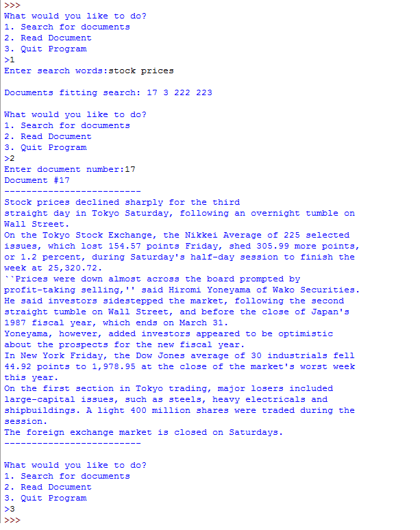

# Document Retrieval

## Background
Document retrieval is the task of finding documents that meet the search criteria input by a user.  The most well-known example is web search, where a user types in a set of key words and the search engine finds web pages that are relevant to their search query.  True document retrieval can be quite difficult, as it needs to take into account many different factors.  In this project you will implement a very simple document retrieval engine.

## Program Specifications
The file “ap_docs.txt” contains several old newswire articles. We will use this as our document collection; when a user gives us a set of keywords we will find the documents in this collection that match their search terms. Each article in the collection is separated by a line that contains only the “<NEW DOCUMENT>” token.  

Your program will read in the documents from the file and number each document starting with 1 (the first document in the file is document 1, the second is document 2, etc.).  In order to look up search terms, we will need to know which words appear in each document. We will use a dictionary for this purpose. *Each entry in your dictionary should have a word as the key and the word’s value as the set of documents that this word appears in*. This arrangement allows you to look up a keyword in the dictionary and immediately get all the documents that it appears in, making it easy to figure out documents that might meet a search query.

Once your program has read the file, it will prompt the user to do one of three things: 1) search for documents that match the search words input by the user, 2) display a document, or 3) quit the program.  If the user choses to search, your program should prompt for a string of search words and find documents that contain all of those keywords. It will then print out the document number of all of the relevant documents. If no documents in the collection contain every keyword input by the user, your program should print a message that says that no relevant documents were found.  If the user chooses to display a document, your program should prompt for a document number and print out the entire document that corresponds to that number. Your program should continue to prompt until the user chooses to quit. 

**Example:**



## Assignment Notes

1. You will likely need to store two types of data in two different data structures.  In one, you will have a dictionary that stores single words as the key with the value as the set of documents (numbers) that the word appears in. In the other data structure, you will store the actual text of the documents, so that you can display it for the user when they ask.  You can use a list or a dictionary for the second data structure.
2. Search queries should not be case sensitive, i.e. searching for “Stocks” should give all documents that contain ‘stocks’, ‘STOCKS’, etc.
3. You should remove punctuation from the start and end of a word as well. If the string “stock,” appears in the document, this should be counted as an instance of the word “stock” (without the comma).  You might find the string module’s string.punctuation useful.
4. Don’t forget to convert strings to numbers (and vice versa) where appropriate.
5. You may find sets to be useful.  Sets are unordered collections that cannot contain duplicate values. Like lists, you can go through the values in a set with a for loop.  You can add elements to a set with the ‘add’ method. You can also make a set out of an existing list. If you want to find the values that are common between two sets, you can use set intersection:

    ```python
    >>> set1 = set()  # initialize to an empty set
    >>> set1.add(2)
    >>> set1.add(3)
    >>> set1
    {2, 3}
    >>> my_lst = [3,3,1,3,5]
    >>> set2 = set(my_lst)
    >>> set2
    {1, 3, 5}
    >>> set3 = set1 & set2  # intersection of set1 and set2
    >>> set3
    {3}
    ```
6. Begin small.  We have provided a tiny test file for development: “ap_docs2.txt”.  This file has three two-line documents.  A sample output using this file is appended below.

7. Develop in pieces.

    - You may want to modify the ap_docs2.txt file to make it all lower case and remove punctuation for now—adding them back in for step (k) below.
    - Read and print the whole file—just to do something to get started.
    - Read the file, divide the file into documents, and put the documents in a list.  I simply made a long string out of each document.  The main idea here is to collect lines of a file into a document string until you encounter the token that indicates the start of the next document.  At that point, append your document string to your list and start the next document with an empty string.
    - Make step (b) into a function that returns the list.
    - Starting with an empty dictionary, go through each document in your list one word at a time.  If a word is in your dictionary, add the current document number to the word’s set.  If a word isn’t yet in the dictionary, add it to the dictionary with its value as a set with the current document number as its only element.
    - Make step (d) into a function that returns the dictionary.
    - Prompt for one search word and use your dictionary to find the documents (numbers) that contain that word.
    - Next enter two words at the prompt, use the dictionary to find each word’s documents, and then use the set intersection operation to find the common documents.
    - Make step (h) a function that returns a set of documents.  Also, make it general enough to handle any number of search words.
    - Now work on the main part of the program that is a loop that prompts for user input.
    - Put upper case and punctuation back into the test file ap_docs2.txt
    - Thoroughly test on ap_docs2.txt, and then test on the full ap_docs.txt file